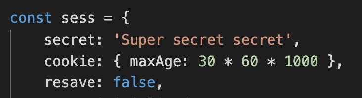

# Tech Blog
This project is to build a CMS-style blog site so that developers who writes about tech can publish articles, their thoughts and opinions

## Table of Contents
* [Installation](#installation)
* [Built With](#built-with)
* [Features](#features)
* [Live URL](#live-url)
* [Demo Gif](#demo-gif)
* [Author](#author)
* [Questions](#questions)
* [Acknowledgments](#acknowledgments)

## Installation
```bash
git clone https://github.com/qtian13/techBlog.git
```
1. Log in mysql to create the database with command `SOURCE ./db/schema.sql`
2. Create a file named .env in the root directory and store your own local varialbes like DB_NAME, DB_USER, DB_PW
3. Run the following command to install required packages, seeds database
```bash
npm init -y
npm i
npm run seed
```
## Built With
* [JavaScript](https://www.javascript.com/)
* [NodeJS](https://nodejs.org/en/)
* [npm](https://www.npmjs.com/)
* [mysql](https://www.mysql.com/)

## Features
* When user visit the site for the first time, they are presented with the homepage, which includes existing blog posts if any have been posted; navigation links for the `homepage` and the `dashboard`; and the option to `log in` or `sign up`
* When user click on the homepage option, they are taken to the homepage
* When user click on any other links in the navigation they are prompted to either sign up or sign in
* When user choose to sign up, they are prompted to create a username and password
* When user click on the sign-up button, their user credentials are saved and they are logged into the site
* When user revisit the site at a later time and choose to sign in, they are prompted to enter their username and password
* When user are signed in to the site, they see navigation links for the `homepage`, the `dashboard`, and the option to `log out`
* When user click on the homepage option in the navigation, then they are taken to the homepage and presented with existing blog posts that include the post title and the date created
* When user click on an existing blog post, they are presented with the post title, contents, post creator’s username, and date created for that post and have the option to leave a comment
* When user enter a comment and click on the `submit` button while signed in, the comment is saved and the post is updated to display the comment, the comment creator’s username, and the date created
* When user click on the dashboard option in the navigation, they are taken to the dashboard and presented with any blog posts I have already created and the option to add a new blog post
* When user click on the `+ New Post` button to add a new blog post, they are prompted to enter both a title and contents for my blog post
* When user click on the `Create` button to create a new blog post, the title and contents of their post are saved and they are taken back to an updated dashboard with their new blog post
* When user click on one of their existing posts in the dashboard, they are able to `delete` or `update` their post and taken back to an updated dashboard
* When user click on the `logout` option in the navigation, they are signed out of the site
* When user is idle on the page for more than 30 min, they are automatically signed out of the site

   


## Live URL
Check the page: [https://secure-reaches-70469.herokuapp.com/](https://secure-reaches-70469.herokuapp.com/)

## Demo Gif


## Author
Qiushuang Tian
- [Link to Portfolio Site](https://qtian13.github.io/myPortfolio/)
- [Link to Github](https://github.com/qtian13)
- [Link to LinkedIn](https://www.linkedin.com/in/qiushuang-tian-a9754248/)

## Questions
Please reach me out with additional questions!

Emails: qiushuang.tian@gmail.com

## Acknowledgments
- [Berkeley Coding Boot Camp](https://bootcamp.berkeley.edu/coding/) provided mock up image and file jass.css